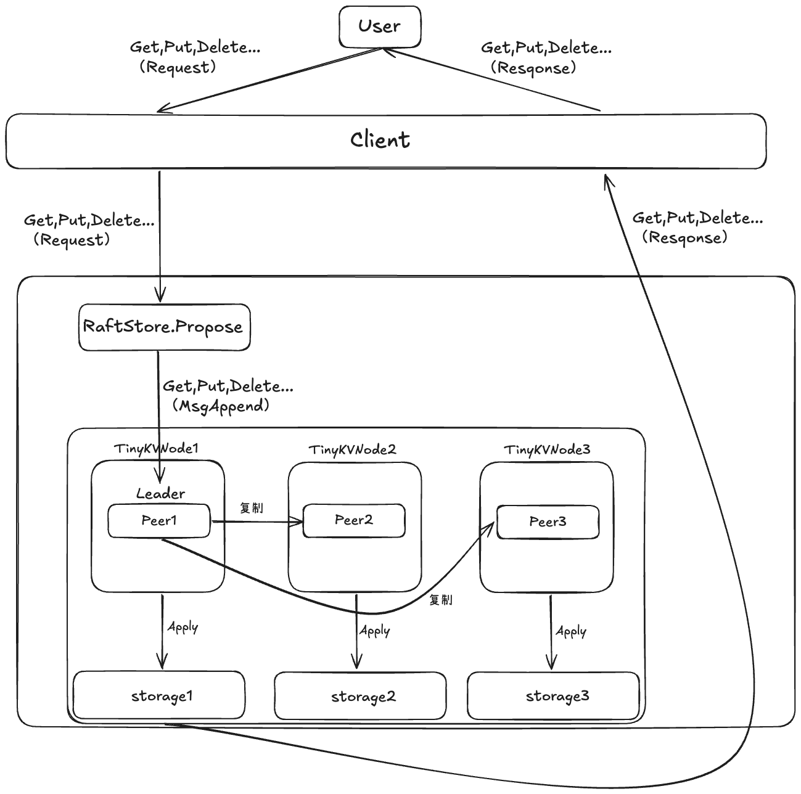
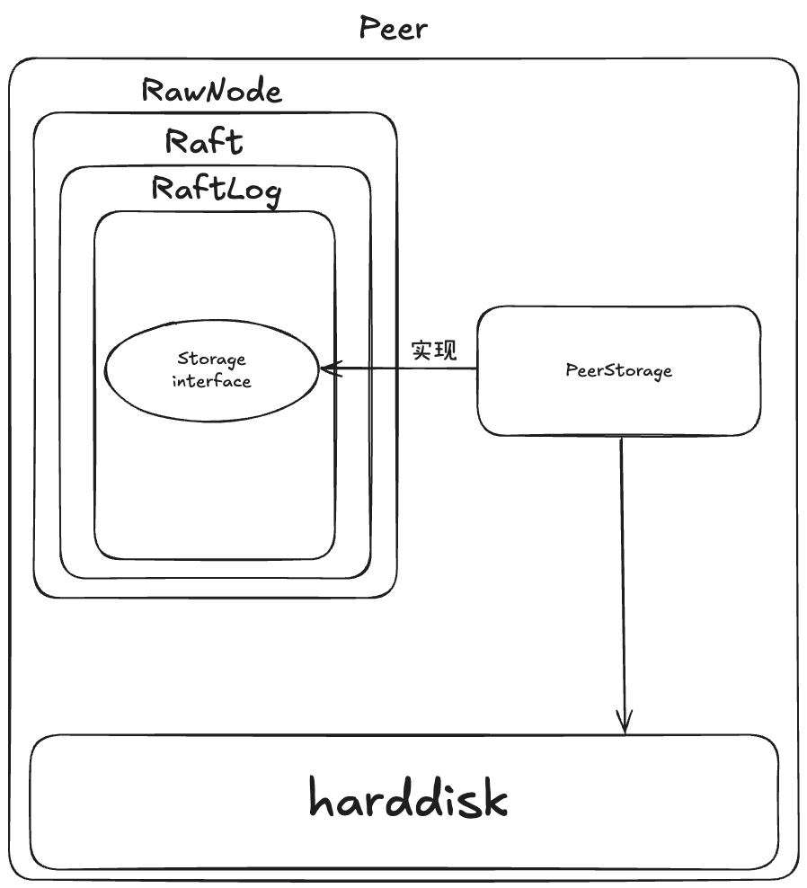
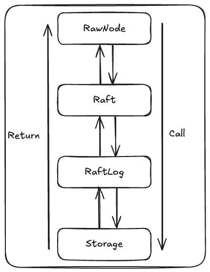
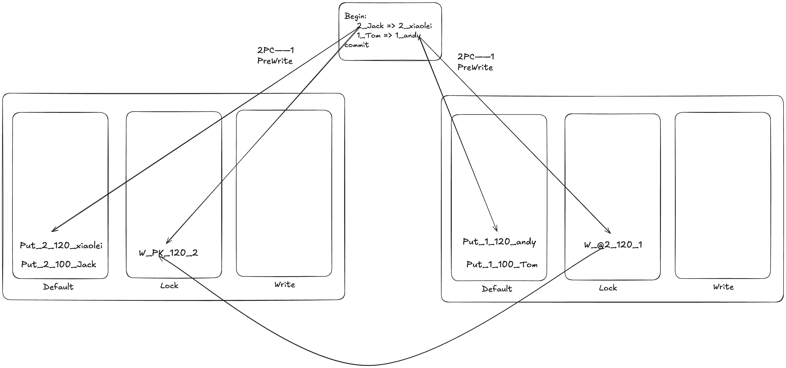
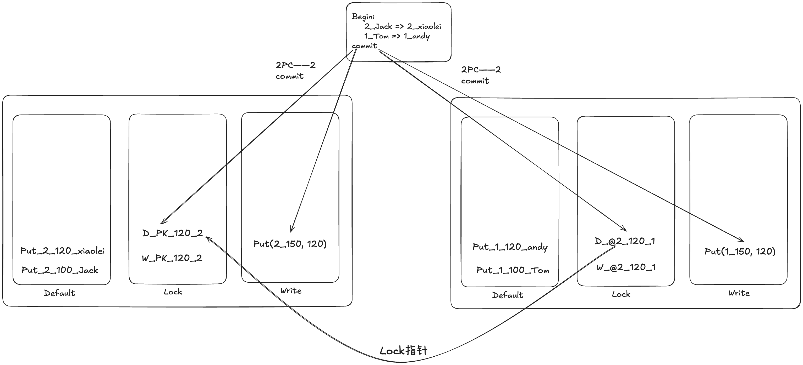

# TinKV 及 Raft 总结
准备春招之余，来简单总结一下这个项目，也是对这个项目做一个全局的回顾。不然都要忘了...
## 1. Lab-1 （没什么好说的
确实没什么好说的，实现读写请求就行，想想刚接手这个 Lab 的时候，手足无措的自己，真是笑死，果然还是万事开头难，好在还是坚持下来了😂。
## 2. Lab-2
我认为 Lab-2 是整个 TinyKV 的基础，只要 Lab2 通了，Lab-3 只是对 Lab-2 的调用罢了，不必担心，因此，2 这里至关重要，一个简单的小操作都有可能导致在 Lab-3 中出现难以复现的错误

##### 这一节开始正式的 Raft 算法，我先从 Raft 的内部（package raft）梳理，奥对了，在这里附上我画的整体图，以便定位。

### 2.1 Raft 选举流程
首先 Raft 的角色被分为 Leader，Follower，Candidate
#### Follower
1. 当 Follower 感知到此时集群中的 Leader 无了，且等到超时选举器到时间，晋升为 Candidate，后将自己的 Term ++，并且向集群中的所有可达节点发送拉票请求。（follower 竞选）
2. 当 Follower 收到拉票信息是，会先通过 Term 来判断是否拒绝投票（Follower 在一个 Term 内只能发送一票），如果不拒绝，会判断候选人的日志是不是比自己的新，会通过其拉票请求中 logterm 和 logidx 来判断，如果对方日志没有自己的新，则直接拒绝，如果比自己的新，则同意投票

#### Candidate
1. 当 Candidate 发送完拉票信息后，重新启动选举倒计时。此时，会对投票进行响应收集，在投票选举倒计时内，如果收到的否决数占大多数，则会直接退化为 Follower；如果通过数占大多数，则会变成 Leader，进入 Leader 处理流程。如果无法判断，则在倒计时结束后，重新进行新一轮拉票
2. 当 Candidate 收到 term 比自己大的请求，则直接变为 Follower，否则会保持竞争

#### Leader
1. 当 Leader 收到 Term 比自己大的拉票信息时，则会退化为 Follower
2. 当 Leader 新上任，会发送一次空条目写请求，以防止论文中出现的以提交日志被回滚的现象

### 2.2 Raft日志提议请求
提议是 2PC 的第一个阶段，commite 的 2PC 的第二个阶段

#### Leader
1. 当 Leader 接收到一次写请求时，会先通过广播通知其他节点，追加这些条目，如果此时回应 ACK 的数量占据大多数，则 Leader 更新自己的 CommiteIdx，代表 Log 已经提交，此时 Leader 会回应客户端的写请求，告诉他请求已完成。**注意，此时数据只是提交，但还没有被写入哦，只是站在 Raft 的视角来看，commite 的数据就代表已经写入，至于底层什么时候应用，那是系统的事。也就是说，commite 了的日志，就代表事务完成的数据，不能回滚**
2. 在日志追加请求中会有两个字段（追加日志的前一条日志的 idx 和 term），**这两个字段十分关键！！！！看以下规则**
   
    Raft 日志有两个关键特性：1. term 和 idx 相等的日志，一定是同一条日志（term 期内的 leader 唯一性原则）2. 两个不同的成员的 log 列表中，idx 和 term 相同的日志之前的条目也一定是相同的（追加规则）

    prev_idx 和 prev_term 就是为了保证第二个规则的实现的
3. 当 Leader 发给成员的请求被拒绝后，leader 就知道了，我的此次发送的追加log 与他们的log之间有 gap，于是会往前发送多发送一个日志，一步一步，直到 follower 他们接受（这里可以考虑一个最最坏的情况，也就是从 0 发送全部的条目）

#### Follower 和 Candidate
1. 在 L 眼中，F 和 C 没有区别，都要接受 L 的日志追加请求
2. 他们收到追加请求后，需要通过 prev_idx 和 prev_term 来找到自己 log 列表中的与之对应的条目，然后将对应位置之后的条目全部删除（认为形成日志冲突），然后将追加的条目追加进去。
    
    如果没有找到与之对应的条目，他们会拒绝此次追加，然后让 leader 去慢慢找寻该发什么给他们（当然也没这么白痴，他们会告诉 leader 自己缺哪些，让 leader 自己去判断发送）
3. 追加成功后，还要根据消息里的 commiteidx 来看看当前 leader 提交到那个位置了，然后同步更新自己的提交进度
### 2.3 Raft 心跳
#### Leader
1. Leader 会检查当心跳倒计时，来给成员发送心跳，告诉他们此时 Leader 还存活。
2. 当收到心跳回应后，如果收到的回应拒绝占大多数，则 Leader 会自己退化为 follower
#### Follower 和 Candidate
1. 收到心跳后，他们会判断此时，这个 Leader 的 term 是不是比自己的大，因为由于存在短暂脑裂的可能，所以不能盲目回应 leader 心跳
2. 收到合法心跳后，follower 会重置选举倒计时，candidate 会退化为 follower 并重置倒计时
### 2.1 Raft的关键点（这里穷举关键点，只为了提醒自己）
1. Raft 建立在 Term 之上，选举时，Term 为主，log 为辅。但是在处理其他命令时，Term 有绝对的优先级。
2. RaftLog 建立在 {LogIndex, LogTerm} 对之上
3. 如果两个成员日志中的条目具有相同的索引和任期号，则它们存储相同的命令。（因为一个 term 内只能有一个 leader）
4. 如果两个成员日志中的条目具有相同的索引和任期号，则该日志在所有前序条目上也是完全一致的。（因为追加日志是，是从匹配到的位置开始加的，递推证明）
5. 新 leader 一定拥有旧 leader 提交的日志（通过 3，4 两点佐证）
### Raft 的 一些问题
#### 1.是否一项提议只需要被多数派通过就可以提交？(论文里那个五个节点的例子)
    不能，当 leader 选举上任后，不能立刻提交老的日志，而是至少处理一次追加请求，才能提交，所以，实现的时候当 leader 上任后要追加一个 nope
#### 2. 会不会出现脑裂？
    会，这个其实是在 lab2b 中会出现的，但是由于 Raft 的日志追加和心跳，导致只会出现短暂的脑裂
    假设现在有 ABCDE 五个点，A 是 Leader，此时如果发生分区，CDE 为一区，AB 为一区，CDE 选举出一个 Leader D，此时就发生了脑裂。（虽然在短暂的分区后，A 会因为收不到心跳回应会退化，但是在没退化的时候，客户端来消息了呢？）
    假设脑裂时来消息了，A 和 D 都处理消息，但是 A 始终追加不了大多数，所以提议会失败，也就是说，脑裂处于少部分分区的 Leader 是无法工作的，然后等分区结束后，又会被多数派的 Leader 占位。（这里会引出 prevote 的优化）
#### 3. Raft-Term 无意义增长
    书接 2，如果 AB 始终没有回复分区，导致 A 或 B 都一致反复进行选举，他们的 Term 会无意义的增大到天文数字。那么这时，如果分区恢复，会发生什么？恢复后，虽然他们的 Term 很大，但是由于日志的落后行，所以他们始终无法成为 Leader，等原来的分区成员慢慢竞选的把 Term 追上来后，系统又恢复正常了。
    但是有没有办法来避免出现这些问题呢？有的兄弟，有的。Prevote，也就是当Candidate选举的时候，会先试探性发送拉票并且在拉票信息中 term + 1，如果收到超半数，在变成 leader后 并且 term++，如果没有，则 term 不变。
#### 4. Raft 保证了状态机的最终一致性还是实时一致性？
    注意我之前说的，Raft 的写事务是到 commite 停的，也就是在 Raft 视角里，commite 的日志代表已经写入了，只是因为效率问题，先提前告诉客户端已经写入。但是对于客户端来讲，她如果立刻去查，不一定能查到，因为可能状态机还没 apply，所以保证了最终一致性。

## 3. Lab-3
我任务 Lab-3 的难点都是 Lab-2 造成的，其本身并没有太多的难点，只是需要阅读的内容较多，其次是调试难度简直是世界末日
### 3.1 Lab3-A Leader-Transfer
这个 Lab 的主要任务就是当节点收到 Leader 请求时，需要将自己的 Leader 权转让给目标

1. 节点收到 LeaderTransfer 要先判断自己是不是 Leader，如果是的话，则进行后续步骤，如果不是，则消息作废
2. 当转移 L 时，节点要先判断被转移对象的 Log 是否已经和自己同步，如果同步，则发送消息让其进行选举，如果没有同步，则发送日志同步请求（这一步是为什么呢？）
   1. 如果 L 在 F 没有与 L 达成日志同步时，就转移控制权；我们假设一个场景，如果 L-A 转移控制权，BCD 都已经同步了他的日志，E 还没有同步，但是他将控制权给 E，此时，我们假设最坏情况 E 一个日志都没同步，那么这个时候，E的选举是不会成功的，因为节点不会把票投给日志落后自己的节点的，所以为了保证转移对象的选举成功，要保证他们日志是同步的
3. 等 F 的日志同步后，直接让其开始选举
4. 如果在一个选举周期内，F 没有选举成功，则原 L 重回 Leader，如果成功，则 L 要将自己的 TransFerLeader 置为 none，并且彻底变成一个 F

### 3.2 Lab3-A Add/Remove Node
ConfVersion 是控制 Raft 节点变更的关键，如果一个 Raft 请求的变更版本小于当前版本，则拒绝这个请求（可能是历史滞留的请求，没有发送过来）。可以这么理解，假设上面一个管理员要增删节点，一定是基于最新版本来增删吗，所以要检查 conferversion，即使管理员不小心搞错版本，那么在系统内也会帮他进行check
1. AddNode
   1. 对于增删 Node，在大部分 Raft 节点都通过了这项提议，才能进行添加。
   2. 增加前先判断节点存在与否
2. DeleteNode
   1. 对于删除节点，也是一致
   2. 但是要住一个特殊情况，假设当前只有两个节点，我要删除 Leader，此时，不能进行，或者说要加一点保证策略。
      1. 首先，为什么不行呢？假设 A，B，A 为 L，A 删除操作，虽然 B 同步了 A 的日志，但是 commite 还没有推进。此时，由于网络分区，A 发给 B 的 commite 同步信息丢失啦，而 A 因为肯定是领先 B 的，A 直接 destory 自己，B 就永远无法选举了，因为 B 需要得到 A 的选票
      2. 怎么办嘞？粗暴一点，如果只有两个节点，并且此时删除 L，则拒绝提议，并且将TransFerLeader to 另一个节点。这里我的实现比较粗暴，只要删除 Leader，就直接拒绝，然后转移控制权
      3. **TMD伤心的人别删 Leader**
   3. 然后正常删除就行了，如果删除的是自己，直接启动 destory 函数，如果不是自己就删除数据库中保留的对应的 raft 痕迹就行

### 3.3 Lab3-B Split
Ontick()会定期检查每个 Region 的大小，来判断当前的 Region 是不要进行分裂，判断依据主要是 Region 当前的大小
## 4. Lab-4
这里难度也不大，和 Lab-1 持平，主要是理解读写加锁流程，这里贴上我画的示意图
### 2PC——1——PreWirte

### 2PC——2——commite

#### 这就是两阶段提交模型
    1. 先预写入要改的数据，并且加锁，注意，这里的锁只有第一个是主锁PK，其他都是副锁，里面包含指向 PK 的指针，写入的数据要包含事务的开始时间，锁也要加入事务开始时间
    2. 当一阶段结束后，进行第二阶段提交
    3. 提交时，在 Write 中记录提交信息，包含此次事务修改的主键和结束信息，以及事务的开始信息；并且对应在 Lock 数据库中加入删除锁的条目。

### 当读请求到来（MVCC）
    1. 读请求先去 Write 数据库中找到最新的提交信息，然后将主键和事务开始时间做一个拼接，变成新的 Key，然后去 Lock 中查询，发现事务锁已经被解除，则直接去 default 中获取数据；如果没有被解除，则在 default 中找到比这个 key 更早的数据作为返回
    2. 如果 Write 中没有（可能事务还没提交），则去 Lock 中查询，找到 Lock 如果有锁，则去 default 中找到上锁时间线前一个的数据；如果没锁，则直接在 default 中找到最新的即可

#### **不难发现，TinyK 在 2PC 的过程中的对 k-v 的加上时间的这个步骤很好的支持了 MVCC，在 MySQL 中，事务的 MVCC 也是由事务开始和结束时间来推动的。**