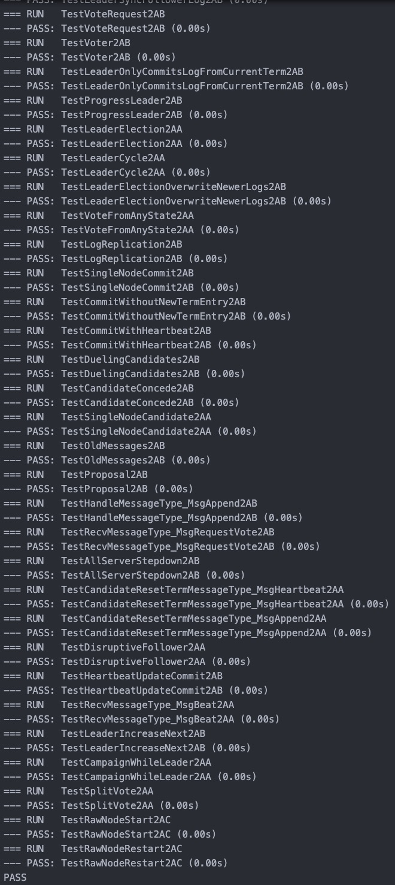
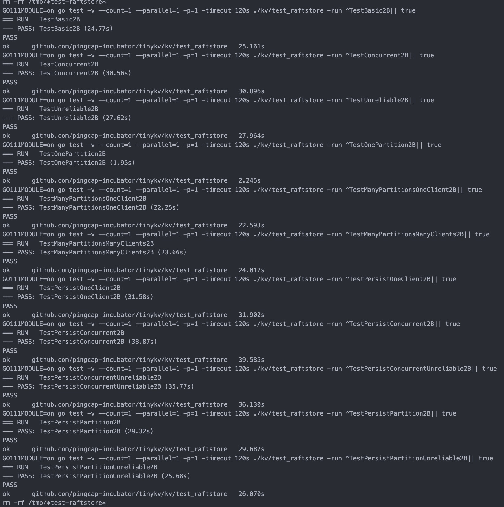
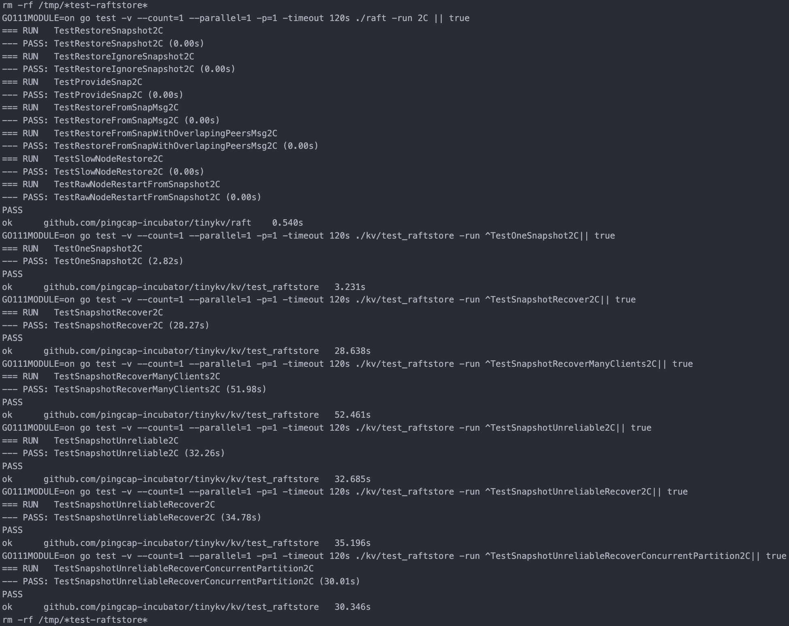

# TinyKV 项目

一个基于 RocksDB 的分布式数据库学习项目，项目一共分为四个 Part

## PartA（Standalone KV）✅

- 实现一个独立的存储引擎 ✅
- 实现原始的键值服务处理程序 ✅
  

## PartB (Raft KV) ✅

- 2A 实现基本的 Raft 算法 ✅
  
- 2B 在 Raft 之上构建一个容错的键值服务器 ✅
- 
- 2C 添加 Raft 日志垃圾回收和快照支持 ✅
- 

## PartC (Multi-Raft KV)

- 在 Raft 算法中实现成员变更和领导者变更
- 在 Raft 存储上实现配置变更和 Region 分裂
- 实现一个基础的调度器

## PartD (Transaction)

- 实现多版本并发控制（MVCC）层
- 实现 KvGet、KvPrewrite 和 KvCommit 请求的处理程序
- 实现 KvScan、KvCheckTxnStatus、KvBatchRollback 和 KvResolveLock 请求的处理程序
