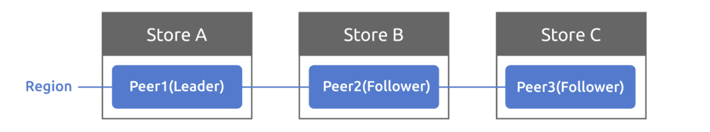

# 项目2 RaftKV

Raft 是一种易于理解的共识算法。你可以在 [Raft 网站](https://raft.github.io/) 上阅读有关 Raft 的资料，查看 Raft 的交互式可视化工具，以及其他资源，包括 [Raft 扩展论文](https://raft.github.io/raft.pdf)。

在本项目中，你将基于 Raft 实现一个高可用的键值存储服务器。这不仅需要你实现 Raft 算法，还需要你将其应用到实际场景中，并带来更多挑战，比如使用 `badger` 管理 Raft 的持久化状态、为快照消息添加流控制等。

该项目分为三个部分，你需要完成以下内容：

- 实现基本的 Raft 算法
- 在 Raft 之上构建一个容错的键值服务器
- 添加 Raft 日志压缩和快照支持

## 第一部分

### 代码

在这一部分，你将实现基本的 Raft 算法。你需要实现的代码位于 `raft/` 目录下。在 `raft/` 目录中，有一些框架代码和测试用例等待你完成。你将在这里实现的 Raft 算法与上层应用程序有一个设计良好的接口。此外，它使用逻辑时钟（在这里称为 tick）来测量选举和心跳超时，而不是物理时钟。也就是说，不要在 Raft 模块内部设置定时器，上层应用程序负责通过调用 `RawNode.Tick()` 来推进逻辑时钟。除此之外，消息的发送和接收以及其他操作都是异步处理的，具体何时执行这些操作也由上层应用程序决定（详见下文）。例如，Raft 不会阻塞等待任何请求消息的响应。

在实现之前，请先查看本部分的提示。此外，你应该大致浏览一下 proto 文件 `proto/proto/eraftpb.proto`。Raft 发送和接收的消息及相关结构体都在那里定义，你将在实现中使用它们。请注意，与 Raft 论文不同，它将心跳和追加日志条目分为不同的消息，以使逻辑更加清晰。

这一部分可以分为三个步骤，包括：

- 领导者选举
- 日志复制
- RawNode 接口

### 实现 Raft 算法

`raft.Raft` 在 `raft/raft.go` 中提供了 Raft 算法的核心功能，包括消息处理、驱动逻辑时钟等。更多实现指南，请查看 `raft/doc.go`，其中包含设计概述以及这些 `MessageTypes` 的职责。

#### 领导者选举

要实现领导者选举，你可以从 `raft.Raft.tick()` 开始，它用于将内部逻辑时钟推进一个 tick，从而驱动选举超时或心跳超时。你现在不需要关心消息的发送和接收逻辑。如果你需要发送消息，只需将其推送到 `raft.Raft.msgs`，所有 Raft 接收到的消息都将通过 `raft.Raft.Step()` 传递。测试代码将从 `raft.Raft.msgs` 获取消息，并通过 `raft.Raft.Step()` 传递响应消息。`raft.Raft.Step()` 是消息处理的入口，你应该处理像 `MsgRequestVote`、`MsgHeartbeat` 及其响应等消息。此外，请实现测试桩函数并正确调用它们，比如 `raft.Raft.becomeXXX`，它用于在 Raft 角色变化时更新 Raft 的内部状态。

你可以运行 `make project2aa` 来测试实现，并在本部分末尾查看一些提示。

#### 日志复制

要实现日志复制，你可以从处理 `MsgAppend` 和 `MsgAppendResponse` 开始，包括发送方和接收方的处理。查看 `raft.RaftLog` 在 `raft/log.go` 中，它是一个帮助管理 Raft 日志的结构体。在这里，你还需要通过 `raft/storage.go` 中定义的 `Storage` 接口与上层应用程序交互，以获取持久化的数据，如日志条目和快照。

你可以运行 `make project2ab` 来测试实现，并在本部分末尾查看一些提示。

### 实现 RawNode 接口

`raft.RawNode` 在 `raft/rawnode.go` 中是我们与上层应用程序交互的接口。`raft.RawNode` 包含 `raft.Raft` 并提供一些包装函数，如 `RawNode.Tick()` 和 `RawNode.Step()`。它还提供了 `RawNode.Propose()`，让上层应用程序提议新的 Raft 日志。

另一个重要的结构体 `Ready` 也在这里定义。当处理消息或推进逻辑时钟时，`raft.Raft` 可能需要与上层应用程序交互，比如：

- 向其他节点发送消息
- 将日志条目保存到稳定存储
- 将硬状态（如任期、提交索引和投票）保存到稳定存储
- 将已提交的日志条目应用到状态机
- 等等

但这些交互不会立即发生，而是封装在 `Ready` 中，并通过 `RawNode.Ready()` 返回给上层应用程序。由上层应用程序决定何时调用 `RawNode.Ready()` 并处理它。处理完返回的 `Ready` 后，上层应用程序还需要调用一些函数，如 `RawNode.Advance()`，以更新 `raft.Raft` 的内部状态，如应用索引、稳定日志索引等。

你可以运行 `make project2ac` 来测试实现，并运行 `make project2a` 来测试整个第一部分。

> 提示：
>
> - 在 `raft.Raft`、`raft.RaftLog`、`raft.RawNode` 和 `eraftpb.proto` 的消息中添加你需要的任何状态
> - 测试假设 Raft 第一次启动时任期应为 0
> - 测试假设新选举的领导者应在其任期内追加一个 noop 条目
> - 测试假设一旦领导者推进其提交索引，它将通过 `MessageType_MsgAppend` 消息广播提交索引
> - 测试不会为本地消息 `MessageType_MsgHup`、`MessageType_MsgBeat` 和 `MessageType_MsgPropose` 设置任期
> - 领导者和非领导者的日志条目追加方式有很大不同，有不同的来源、检查和处理方式，请小心处理
> - 不要忘记不同节点之间的选举超时应不同
> - `rawnode.go` 中的一些包装函数可以通过 `raft.Step(local message)` 实现
> - 启动新的 Raft 时，从 `Storage` 获取最后的稳定状态以初始化 `raft.Raft` 和 `raft.RaftLog`

## 第二部分

在这一部分，你将使用第一部分实现的 Raft 模块构建一个容错的键值存储服务。你的键值服务将是一个复制的状态机，由多个使用 Raft 进行复制的键值服务器组成。只要大多数服务器存活并能够通信，你的键值服务应继续处理客户端请求，尽管其他故障或网络分区。

在项目1中，你已经实现了一个独立的键值服务器，因此你应该已经熟悉了键值服务器 API 和 `Storage` 接口。

在介绍代码之前，你需要先理解三个术语：`Store`、`Peer` 和 `Region`，它们在 `proto/proto/metapb.proto` 中定义。

- Store 代表一个 tinykv-server 实例
- Peer 代表在 Store 上运行的 Raft 节点
- Region 是 Peer 的集合，也称为 Raft 组



为简单起见，项目2中一个 Store 上只有一个 Peer，一个集群中只有一个 Region。因此你现在不需要考虑 Region 的范围。多个 Region 将在项目3中进一步介绍。

### 代码

首先，你应该查看 `RaftStorage`，它位于 `kv/storage/raft_storage/raft_server.go`，它也实现了 `Storage` 接口。与直接写入或读取底层引擎的 `StandaloneStorage` 不同，它首先将每个写和读请求发送到 Raft，然后在 Raft 提交请求后实际写入和读取底层引擎。通过这种方式，它可以保持多个 Store 之间的一致性。

`RaftStorage` 创建一个 `Raftstore` 来驱动 Raft。当调用 `Reader` 或 `Write` 函数时，它实际上通过通道（通道是 `raftWorker` 的 `raftCh`）向 raftstore 发送一个 `RaftCmdRequest`，该请求在 `proto/proto/raft_cmdpb.proto` 中定义，包含四种基本命令类型（Get/Put/Delete/Snap），并在 Raft 提交并应用命令后返回响应。`Reader` 和 `Write` 函数的 `kvrpc.Context` 参数现在很有用，它携带了从客户端视角的 Region 信息，并作为 `RaftCmdRequest` 的头部传递。这些信息可能不正确或过时，因此 raftstore 需要检查它们并决定是否提议该请求。

然后，TinyKV 的核心——raftstore 就出现了。结构有点复杂，阅读 TiKV 参考以获得更好的理解：

- <https://pingcap.com/blog-cn/the-design-and-implementation-of-multi-raft/#raftstore>  (中文版)
- <https://pingcap.com/blog/design-and-implementation-of-multi-raft/#raftstore> (英文版)

raftstore 的入口是 `Raftstore`，参见 `kv/raftstore/raftstore.go`。它启动了一些 worker 来异步处理特定任务，其中大部分现在没有使用，因此你可以忽略它们。你只需要关注 `raftWorker`（位于 `kv/raftstore/raft_worker.go`）。

整个过程分为两部分：raft worker 轮询 `raftCh` 以获取消息，包括驱动 Raft 模块的基本 tick 和作为 Raft 条目提议的 Raft 命令；它从 Raft 模块获取并处理 ready，包括发送 Raft 消息、持久化状态、将已提交的条目应用到状态机。一旦应用完成，返回响应给客户端。

### 实现 Peer 存储

Peer 存储是你通过第一部分中的 `Storage` 接口与之交互的内容，但除了 Raft 日志外，Peer 存储还管理其他持久化的元数据，这些元数据对于在重启后恢复一致的状态机非常重要。此外，`proto/proto/raft_serverpb.proto` 中定义了三个重要的状态：

- RaftLocalState：用于存储当前 Raft 的 HardState 和最后的日志索引。
- RaftApplyState：用于存储 Raft 应用的最后一个日志索引和一些截断的日志信息。
- RegionLocalState：用于存储 Region 信息以及该 Store 上对应的 Peer 状态。Normal 表示该 Peer 正常，Tombstone 表示该 Peer 已从 Region 中移除，无法加入 Raft 组。

这些状态存储在两个 badger 实例中：raftdb 和 kvdb：

- raftdb 存储 Raft 日志和 `RaftLocalState`
- kvdb 存储不同列族中的键值数据、`RegionLocalState` 和 `RaftApplyState`。你可以将 kvdb 视为 Raft 论文中提到的状态机

格式如下，`kv/raftstore/meta` 中提供了一些辅助函数，并使用 `writebatch.SetMeta()` 将它们设置到 badger 中。

| 键              | 键格式                        | 值            | 数据库   |
| :--------------- | :------------------------------- | :--------------- | :--- |
| raft_log_key     | 0x01 0x02 region_id 0x01 log_idx | Entry            | raft |
| raft_state_key   | 0x01 0x02 region_id 0x02         | RaftLocalState   | raft |
| apply_state_key  | 0x01 0x02 region_id 0x03         | RaftApplyState   | kv   |
| region_state_key | 0x01 0x03 region_id 0x01         | RegionLocalState | kv   |

> 你可能会好奇为什么 TinyKV 需要两个 badger 实例。实际上，它可以只使用一个 badger 来存储 Raft 日志和状态机数据。分成两个实例只是为了与 TiKV 设计保持一致。

这些元数据应在 `PeerStorage` 中创建和更新。创建 `PeerStorage` 时，请参见 `kv/raftstore/peer_storage.go`。它初始化该 Peer 的 RaftLocalState、RaftApplyState，或者在重启的情况下从底层引擎获取之前的值。请注意，RAFT_INIT_LOG_TERM 和 RAFT_INIT_LOG_INDEX 的值都是 5（只要大于 1），而不是 0。之所以不设置为 0，是为了与配置变更后被动创建的 Peer 区分开来。你现在可能不太理解这一点，所以只需记住它，细节将在项目3b 中实现配置变更时描述。

你在这部分需要实现的代码只有一个函数：`PeerStorage.SaveReadyState`，该函数的作用是将 `raft.Ready` 中的数据保存到 badger，包括追加日志条目和保存 Raft 硬状态。

要追加日志条目，只需将 `raft.Ready.Entries` 中的所有日志条目保存到 raftdb，并删除任何之前追加的永远不会被提交的日志条目。同时，更新 Peer 存储的 `RaftLocalState` 并将其保存到 raftdb。

保存硬状态也非常简单，只需更新 Peer 存储的 `RaftLocalState.HardState` 并将其保存到 raftdb。

> 提示：
>
> - 使用 `WriteBatch` 一次性保存这些状态。
> - 查看 `peer_storage.go` 中的其他函数，了解如何读写这些状态。
> - 设置环境变量 LOG_LEVEL=debug，这可能有助于调试，另请参阅所有可用的 [日志级别](../log/log.go)。

### 实现 Raft ready 处理

在项目2的第一部分中，你已经构建了一个基于 tick 的 Raft 模块。现在你需要编写外部流程来驱动它。大部分代码已经在 `kv/raftstore/peer_msg_handler.go` 和 `kv/raftstore/peer.go` 中实现。因此你需要学习代码并完成 `proposeRaftCommand` 和 `HandleRaftReady` 的逻辑。以下是对框架的一些解释。

Raft `RawNode` 已经使用 `PeerStorage` 创建，并存储在 `peer` 中。在 raft worker 中，你可以看到它获取 `peer` 并使用 `peerMsgHandler` 包装它。`peerMsgHandler` 主要有两个功能：一个是 `HandleMsg`，另一个是 `HandleRaftReady`。

`HandleMsg` 处理从 raftCh 接收到的所有消息，包括调用 `RawNode.Tick()` 来驱动 Raft 的 `MsgTypeTick`，包装客户端请求的 `MsgTypeRaftCmd`，以及在 Raft 节点之间传输的 `MsgTypeRaftMessage`。所有消息类型都在 `kv/raftstore/message/msg.go` 中定义。你可以查看详细信息，其中一些将在以下部分中使用。

处理完消息后，Raft 节点应该有一些状态更新。因此 `HandleRaftReady` 应该从 Raft 模块获取 ready 并执行相应的操作，如持久化日志条目、应用已提交的条目以及通过网络向其他节点发送 Raft 消息。

用伪代码表示，raftstore 使用 Raft 的方式如下：

``` go
for {
  select {
  case <-s.Ticker:
    Node.Tick()
  default:
    if Node.HasReady() {
      rd := Node.Ready()
      saveToStorage(rd.State, rd.Entries, rd.Snapshot)
      send(rd.Messages)
      for _, entry := range rd.CommittedEntries {
        process(entry)
      }
      s.Node.Advance(rd)
    }
}
```

之后，整个读取或写入的过程将如下所示：

- 客户端调用 RPC RawGet/RawPut/RawDelete/RawScan
- RPC 处理程序调用 `RaftStorage` 相关方法
- `RaftStorage` 向 raftstore 发送 Raft 命令请求，并等待响应
- `RaftStore` 将 Raft 命令请求提议为 Raft 日志
- Raft 模块追加日志，并通过 `PeerStorage` 持久化
- Raft 模块提交日志
- Raft worker 在处理 Raft ready 时执行 Raft 命令，并通过回调返回响应
- `RaftStorage` 从回调接收响应并返回给 RPC 处理程序
- RPC 处理程序执行一些操作并将 RPC 响应返回给客户端。

你应该运行 `make project2b` 来通过所有测试。整个测试运行一个包含多个 TinyKV 实例的模拟集群，并使用模拟网络。它执行一些读写操作并检查返回值是否符合预期。

需要注意的是，错误处理是通过测试的重要部分。你可能已经注意到，`proto/proto/errorpb.proto` 中定义了一些错误，并且错误是 gRPC 响应的一个字段。此外，`kv/raftstore/util/error.go` 中定义了实现 `error` 接口的相应错误，因此你可以将它们作为函数的返回值。

这些错误主要与 Region 相关。因此它也是 `RaftCmdResponse` 的 `RaftResponseHeader` 的成员。在提议请求或应用命令时，可能会出现一些错误。如果出现错误，你应该返回带有错误的 Raft 命令响应，然后错误将进一步传递给 gRPC 响应。你可以在返回带有错误的响应时使用 `kv/raftstore/cmd_resp.go` 中提供的 `BindRespError` 将这些错误转换为 `errorpb.proto` 中定义的错误。

在这个阶段，你可能会考虑这些错误，其他错误将在项目3中处理：

- ErrNotLeader：Raft 命令在 follower 上提议。因此使用它让客户端尝试其他节点。
- ErrStaleCommand：可能是由于领导者变更，一些日志未提交并被新领导者的日志覆盖。但客户端不知道这一点，仍在等待响应。因此你应该返回此错误，让客户端知道并重试命令。

> 提示：
>
> - `PeerStorage` 实现了 Raft 模块的 `Storage` 接口，你应该使用提供的方法 `SaveReadyState()` 来持久化 Raft 相关的状态。
> - 使用 `engine_util` 中的 `WriteBatch` 以原子方式执行多次写入，例如，你需要确保在一个写批次中应用已提交的条目并更新应用索引。
> - 使用 `Transport` 向其他节点发送 Raft 消息，它位于 `GlobalContext` 中，
> - 如果服务器不是大多数的一部分并且没有最新数据，则不应完成 get RPC。你可以将 get 操作放入 Raft 日志中，或者实现 Raft 论文第8节中描述的只读操作优化。
> - 不要忘记在应用日志条目时更新和持久化应用状态。
> - 你可以像 TiKV 那样以异步方式应用已提交的 Raft 日志条目。这不是必须的，尽管是提高性能的一大挑战。
> - 在提议时记录命令的回调，并在应用后返回回调。
> - 对于 snap 命令响应，应显式设置 badger Txn 到回调。
> - 在 2A 之后，一些测试你可能需要多次运行以发现错误。

## 第三部分

按照你现在的代码，长时间运行的服务器不可能永远记住完整的 Raft 日志。相反，服务器会检查 Raft 日志的数量，并定期丢弃超过阈值的日志条目。

在这一部分，你将基于上述两部分实现快照处理。通常，快照只是一种像 AppendEntries 一样的 Raft 消息，用于将数据复制到 follower，不同的是它的大小，快照包含某个时间点的整个状态机数据，一次性构建和发送如此大的消息会消耗大量资源和时间，可能会阻塞其他 Raft 消息的处理。为了缓解这个问题，快照消息将使用独立的连接，并将数据分块传输。这就是为什么 TinyKV 服务有一个快照 RPC API。如果你对发送和接收的细节感兴趣，请查看 `snapRunner` 和参考 <https://pingcap.com/blog-cn/tikv-source-code-reading-10/>

### 代码

你需要做的所有更改都基于第一部分和第二部分编写的代码。

### 在 Raft 中实现

尽管我们需要对快照消息进行一些不同的处理，但从 Raft 算法的角度来看，应该没有区别。参见 proto 文件中 `eraftpb.Snapshot` 的定义，`eraftpb.Snapshot` 上的 `data` 字段并不代表实际的状态机数据，而是一些由上层应用程序使用的元数据，你现在可以忽略它。当领导者需要向 follower 发送快照消息时，它可以调用 `Storage.Snapshot()` 获取 `eraftpb.Snapshot`，然后像其他 Raft 消息一样发送快照消息。状态机数据实际如何构建和发送由 raftstore 实现，将在下一步中介绍。你可以假设一旦 `Storage.Snapshot()` 成功返回，Raft 领导者就可以安全地向 follower 发送快照消息，follower 应调用 `handleSnapshot` 来处理它，即从消息中的 `eraftpb.SnapshotMetadata` 恢复 Raft 内部状态，如任期、提交索引和成员信息等，之后，快照处理的流程就完成了。

### 在 raftstore 中实现

在这一步中，你需要学习 raftstore 的两个 worker——raftlog-gc worker 和 region worker。

Raftstore 根据配置 `RaftLogGcCountLimit` 定期检查是否需要 gc 日志，参见 `onRaftGcLogTick()`。如果需要，它将提议一个 Raft 管理命令 `CompactLogRequest`，该命令像项目2第二部分中实现的四种基本命令类型（Get/Put/Delete/Snap）一样包装在 `RaftCmdRequest` 中。然后你需要在 Raft 提交此管理命令时处理它。但与 Get/Put/Delete/Snap 命令写入或读取状态机数据不同，`CompactLogRequest` 修改元数据，即更新 `RaftApplyState` 中的 `RaftTruncatedState`。之后，你应该通过 `ScheduleCompactLog` 向 raftlog-gc worker 调度一个任务。Raftlog-gc worker 将异步执行实际的日志删除工作。

然后由于日志压缩，Raft 模块可能需要发送快照。`PeerStorage` 实现了 `Storage.Snapshot()`。TinyKV 在 region worker 中生成快照并应用快照。当调用 `Snapshot()` 时，它实际上向 region worker 发送一个任务 `RegionTaskGen`。region worker 的消息处理程序位于 `kv/raftstore/runner/region_task.go`。它扫描底层引擎以生成快照，并通过通道发送快照元数据。下次 Raft 调用 `Snapshot` 时，它检查快照生成是否完成。如果完成，Raft 应向其他节点发送快照消息，快照的发送和接收工作由 `kv/storage/raft_storage/snap_runner.go` 处理。你不需要深入了解细节，只需知道快照消息在接收后由 `onRaftMsg` 处理。

然后快照将反映在下一个 Raft ready 中，因此你需要做的任务是修改 raft ready 处理以处理快照的情况。当你确定要应用快照时，你可以更新 Peer 存储的内存状态，如 `RaftLocalState`、`RaftApplyState` 和 `RegionLocalState`。此外，不要忘记将这些状态持久化到 kvdb 和 raftdb，并从 kvdb 和 raftdb 中删除过时的状态。此外，你还需要将 `PeerStorage.snapState` 更新为 `snap.SnapState_Applying`，并通过 `PeerStorage.regionSched` 向 region worker 发送 `runner.RegionTaskApply` 任务，并等待 region worker 完成。

你应该运行 `make project2c` 来通过所有测试。