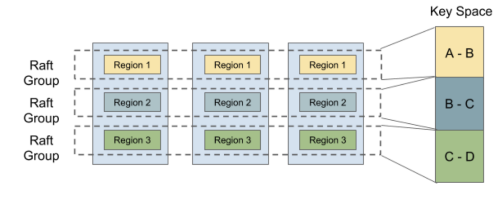

# 项目 3 MultiRaftKV

在项目 2 中，你已经基于 Raft 构建了一个高可用的 kv 服务器，干得不错！但这还不够，这样的 kv 服务器由单个 raft 组支持，而单个 raft 组的扩展能力是有限的，并且每个写请求都会等待提交后依次写入 badger，这是确保一致性的关键要求，但也扼杀了并发性。


在本项目中，你将实现一个基于多 raft 的 kv 服务器，并带有平衡调度器。该服务器由多个 raft 组组成，每个 raft 组负责一个键范围，这里称为 region。布局如上图所示。单个 region 的请求处理方式与之前相同，但多个 region 可以并发处理请求，从而提高了性能，但也带来了一些新的挑战，比如如何平衡每个 region 的请求等。

本项目分为 3 个部分，包括：

1. 在 Raft 算法中实现成员变更和领导权变更
2. 在 raftstore 上实现配置变更和 region 分裂
3. 引入调度器

## 第一部分

在这一部分中，你将在基本的 Raft 算法中实现成员变更和领导权变更，这些功能是后续两部分的基础。成员变更，即配置变更（conf change），用于向 raft 组中添加或删除节点，这会改变 raft 组的法定人数，因此需要小心处理。领导权变更，即领导权转移（leader transfer），用于将领导权转移给另一个节点，这在平衡中非常有用。

### 代码

你需要修改的代码主要集中在`raft/raft.go`和`raft/rawnode.go`中，同时可以查看`proto/proto/eraft.proto`以了解需要处理的新消息。配置变更和领导权转移都是由上层应用触发的，因此你可能需要从`raft/rawnode.go`开始。

### 实现领导权转移

为了实现领导权转移，我们引入两种新的消息类型：`MsgTransferLeader`和`MsgTimeoutNow`。要转移领导权，首先需要在当前领导者上调用`raft.Raft.Step`并传入`MsgTransferLeader`消息。为了确保转移成功，当前领导者应首先检查被转移者（即转移目标）的资格，例如：被转移者的日志是否是最新的等。如果被转移者不符合条件，当前领导者可以选择中止转移或帮助被转移者，既然中止没有帮助，我们选择帮助被转移者。如果被转移者的日志不是最新的，当前领导者应向被转移者发送`MsgAppend`消息，并停止接受新的提案，以防我们陷入循环。如果被转移者符合条件（或在当前领导者的帮助下），领导者应立即向被转移者发送`MsgTimeoutNow`消息。收到`MsgTimeoutNow`消息后，被转移者应立即开始新的选举，无论其选举超时时间如何。由于拥有更高的任期和最新的日志，被转移者有很大机会让当前领导者下台并成为新的领导者。

### 实现配置变更

你将在这里实现的配置变更算法并不是扩展 Raft 论文中提到的联合共识算法，该算法可以一次性添加和/或删除任意节点。相反，它只能逐个添加或删除节点，这更简单且易于推理。此外，配置变更从调用领导者的`raft.RawNode.ProposeConfChange`开始，该调用会提议一个条目，其中`pb.Entry.EntryType`设置为`EntryConfChange`，`pb.Entry.Data`设置为输入的`pb.ConfChange`。当类型为`EntryConfChange`的条目被提交时，你必须通过`RawNode.ApplyConfChange`应用它，并使用条目中的`pb.ConfChange`，然后才能根据`pb.ConfChange`通过`raft.Raft.addNode`和`raft.Raft.removeNode`添加或删除节点。

> 提示：
>
> - `MsgTransferLeader`消息是本地消息，不是来自网络
> - 你将`MsgTransferLeader`消息的`Message.from`设置为被转移者（即转移目标）
> - 要立即开始新的选举，你可以调用`Raft.Step`并传入`MsgHup`消息
> - 调用`pb.ConfChange.Marshal`获取`pb.ConfChange`的字节表示，并将其放入`pb.Entry.Data`

## 第二部分

由于 Raft 模块现在支持成员变更和领导权变更，在这一部分中，你需要使 TinyKV 支持基于第一部分的这些管理命令。正如你在`proto/proto/raft_cmdpb.proto`中看到的，有四种类型的管理命令：

- CompactLog（已在项目 2 的第三部分实现）
- TransferLeader
- ChangePeer
- Split

`TransferLeader`和`ChangePeer`是基于 Raft 的领导权变更和成员变更支持的命令。这些将作为平衡调度器的基本操作步骤。`Split`将一个 Region 分裂为两个 Region，这是多 raft 的基础。你将逐步实现它们。

### 代码

所有的修改都基于项目 2 的实现，因此你需要修改的代码主要集中在`kv/raftstore/peer_msg_handler.go`和`kv/raftstore/peer.go`中。

### 提议转移领导权

这一步非常简单。作为一个 raft 命令，`TransferLeader`将被提议为一个 Raft 条目。但`TransferLeader`实际上是一个不需要复制到其他节点的操作，因此你只需要为`TransferLeader`命令调用`RawNode`的`TransferLeader()`方法，而不是`Propose()`。

### 在 raftstore 中实现配置变更

配置变更有两种不同的类型，`AddNode`和`RemoveNode`。顾名思义，它向 Region 中添加或删除一个 Peer。要实现配置变更，你应该首先学习`RegionEpoch`的术语。`RegionEpoch`是`metapb.Region`元信息的一部分。当一个 Region 添加或删除 Peer 或分裂时，Region 的 epoch 会发生变化。RegionEpoch 的`conf_ver`在配置变更时增加，而`version`在分裂时增加。它用于在网络隔离的情况下保证最新的 region 信息，即一个 Region 中的两个领导者。

你需要使 raftstore 支持处理配置变更命令。流程如下：

1. 通过`ProposeConfChange`提议配置变更管理命令
2. 在日志提交后，更改`RegionLocalState`，包括`RegionEpoch`和`Region`中的`Peers`
3. 调用`raft.RawNode`的`ApplyConfChange()`

> 提示：
>
> - 对于执行`AddNode`，新添加的 Peer 将由领导者的心跳创建，检查`storeWorker`的`maybeCreatePeer()`。此时，这个 Peer 是未初始化的，我们不知道其 Region 的任何信息，因此我们使用 0 初始化其`Log Term`和`Index`。领导者随后会知道这个 Follower 没有数据（从 0 到 5 存在日志间隔），并直接向其发送快照。
> - 对于执行`RemoveNode`，你应该显式调用`destroyPeer()`来停止 Raft 模块。销毁逻辑已为你提供。
> - 不要忘记更新`GlobalContext`中`storeMeta`的 region 状态
> - 测试代码会多次调度一个配置变更的命令，直到配置变更被应用，因此你需要考虑如何忽略相同配置变更的重复命令。

### 在 raftstore 中实现 region 分裂



为了支持多 raft，系统执行数据分片，并使每个 Raft 组只存储一部分数据。哈希和范围是常用的数据分片方法。TinyKV 使用范围，主要原因是范围可以更好地聚合具有相同前缀的键，这对于扫描等操作非常方便。此外，范围在分裂方面优于哈希。通常，它只涉及元数据修改，不需要移动数据。

```protobuf
message Region {
 uint64 id = 1;
 // Region键范围 [start_key, end_key)。
 bytes start_key = 2;
 bytes end_key = 3;
 RegionEpoch region_epoch = 4;
 repeated Peer peers = 5
}
```

让我们重新看一下 Region 的定义，它包括两个字段`start_key`和`end_key`，用于指示 Region 负责的数据范围。因此，分裂是支持多 raft 的关键步骤。最初，只有一个 Region，范围是[“”， “”）。你可以将键空间视为一个循环，因此[“”， “”）表示整个空间。随着数据的写入，分裂检查器会每隔`cfg.SplitRegionCheckTickInterval`检查 region 的大小，并在可能的情况下生成一个分裂键以将 Region 切成两部分，你可以在`kv/raftstore/runner/split_check.go`中查看逻辑。分裂键将包装为`MsgSplitRegion`，由`onPrepareSplitRegion()`处理。

为了确保新创建的 Region 和 Peer 的 id 是唯一的，id 由调度器分配。这也是提供的，因此你不需要实现它。`onPrepareSplitRegion()`实际上为 pd worker 调度一个任务，以向调度器请求 id。并在收到调度器的响应后生成一个分裂管理命令，参见`kv/raftstore/runner/scheduler_task.go`中的`onAskSplit()`。

因此，你的任务是实现处理分裂管理命令的过程，就像配置变更一样。提供的框架支持多 raft，参见`kv/raftstore/router.go`。当一个 Region 分裂为两个 Region 时，其中一个 Region 将继承分裂前的元数据，并只修改其范围和 RegionEpoch，而另一个将创建相关的元信息。

> 提示：
>
> - 这个新创建的 Region 的对应 Peer 应该由`createPeer()`创建，并注册到 router.regions。并且 region 的信息应插入到 ctx.StoreMeta 的`regionRanges`中。
> - 对于网络隔离下的 region 分裂情况，要应用的快照可能与现有 region 的范围重叠。检查逻辑在`kv/raftstore/peer_msg_handler.go`的`checkSnapshot()`中。请在实现时牢记这一点，并处理这种情况。
> - 使用`engine_util.ExceedEndKey()`与 region 的结束键进行比较。因为当结束键等于“”时，任何键都将等于或大于“”。
> - 需要考虑更多的错误：`ErrRegionNotFound`，`ErrKeyNotInRegion`，`ErrEpochNotMatch`。

## 第三部分

如上所述，我们 kv 存储中的所有数据被分成多个 region，每个 region 包含多个副本。一个问题出现了：我们应该将每个副本放在哪里？以及如何为副本找到最佳位置？谁发送之前的 AddPeer 和 RemovePeer 命令？调度器承担了这一责任。

为了做出明智的决策，调度器应该拥有整个集群的一些信息。它应该知道每个 region 的位置。它应该知道它们有多少键。它应该知道它们有多大……为了获取相关信息，调度器要求每个 region 定期向调度器发送心跳请求。你可以在`/proto/proto/schedulerpb.proto`中找到心跳请求结构`RegionHeartbeatRequest`。在收到心跳后，调度器将更新本地 region 信息。

同时，调度器定期检查 region 信息，以发现我们的 TinyKV 集群是否存在不平衡。例如，如果任何存储包含太多 region，应将 region 从该存储移动到其他存储。这些命令将作为相应 region 的心跳请求的响应被拾取。

在这一部分中，你需要为调度器实现上述两个功能。按照我们的指南和框架，这不会太难。

### 代码

你需要修改的代码主要集中在`scheduler/server/cluster.go`和`scheduler/server/schedulers/balance_region.go`中。如上所述，当调度器收到 region 心跳时，它将首先更新其本地 region 信息。然后它将检查该 region 是否有待处理的命令。如果有，它将作为响应发送回去。

你只需要实现`processRegionHeartbeat`函数，在该函数中调度器更新本地信息；以及`Schedule`函数，用于 region 平衡调度器，在该函数中调度器扫描存储并确定是否存在不平衡以及应该移动哪个 region。

### 收集 region 心跳

如你所见，`processRegionHeartbeat`函数的唯一参数是一个 regionInfo。它包含有关此心跳发送者 region 的信息。调度器需要做的只是更新本地 region 记录。但调度器是否应该为每个心跳更新这些记录？

当然不是！有两个原因。一是当该 region 没有变化时，可以跳过更新。更重要的是，调度器不能信任每个心跳。特别是，如果集群在某个部分存在分区，某些节点的信息可能是错误的。

例如，一些 region 在分裂后重新发起选举和分裂，但另一批孤立的节点仍然通过心跳向调度器发送过时的信息。因此，对于一个 region，两个节点中的任何一个都可能说它是领导者，这意味着调度器不能信任它们。

哪一个更可信？调度器应该使用`conf_ver`和`version`来确定，即`RegionEpoch`。调度器应首先比较两个节点的 region 版本值。如果值相同，调度器比较配置变更版本值。配置变更版本值较大的节点必须拥有更新的信息。

简单来说，你可以按以下方式组织检查流程：

1. 检查本地存储中是否存在具有相同 Id 的 region。如果存在，并且至少有一个心跳的`conf_ver`和`version`小于它的，此心跳 region 是过时的

2. 如果不存在，扫描所有与其重叠的 region。心跳的`conf_ver`和`version`应大于或等于所有 region，否则 region 是过时的。

那么调度器如何确定是否可以跳过此更新？我们可以列出一些简单的条件：

- 如果新 region 的`version`或`conf_ver`大于原始 region，则不能跳过

- 如果领导者发生变化，则不能跳过

- 如果新 region 或原始 region 有待处理的 peer，则不能跳过

- 如果 ApproximateSize 发生变化，则不能跳过

- …

不用担心。你不需要找到一个严格的充分必要条件。冗余更新不会影响正确性。

如果调度器根据此心跳确定更新本地存储，它应该更新两件事：region 树和存储状态。你可以使用`RaftCluster.core.PutRegion`更新 region 树，并使用`RaftCluster.core.UpdateStoreStatus`更新相关存储的状态（例如领导者数量、region 数量、待处理 peer 数量…）。

### 实现 region 平衡调度器

调度器中可以运行许多不同类型的调度器，例如 region 平衡调度器和 leader 平衡调度器。本学习材料将重点介绍 region 平衡调度器。

每个调度器都应实现 Scheduler 接口，你可以在`/scheduler/server/schedule/scheduler.go`中找到它。调度器将使用`GetMinInterval`的返回值作为默认间隔，定期运行`Schedule`方法。如果它返回 null（经过几次重试），调度器将使用`GetNextInterval`增加间隔。通过定义`GetNextInterval`，你可以定义间隔如何增加。如果它返回一个操作符，调度器将将这些操作符作为相关 region 的下一个心跳的响应分发。

Scheduler 接口的核心部分是`Schedule`方法。该方法的返回值是`Operator`，它包含多个步骤，例如`AddPeer`和`RemovePeer`。例如，`MovePeer`可能包含`AddPeer`、`transferLeader`和`RemovePeer`，这些你已经在之前的部分实现了。以下图为例，调度器尝试将 peer 从第三个存储移动到第四个存储。首先，它应该为第四个存储`AddPeer`。然后它检查第三个是否是领导者，发现不是，因此不需要`transferLeader`。然后它删除第三个存储中的 peer。

你可以使用`scheduler/server/schedule/operator`包中的`CreateMovePeerOperator`函数创建一个`MovePeer`操作符。


在这一部分中，你唯一需要实现的是`scheduler/server/schedulers/balance_region.go`中的`Schedule`方法。该调度器避免在一个存储中有太多 region。首先，调度器将选择所有合适的存储。然后根据它们的 region 大小进行排序。然后调度器尝试从 region 大小最大的存储中找出要移动的 region。

调度器将尝试在存储中找到最适合移动的 region。首先，它将尝试选择一个待处理的 region，因为待处理可能意味着磁盘过载。如果没有待处理的 region，它将尝试找到一个 follower region。如果仍然无法选择一个 region，它将尝试选择 leader region。最后，它将选择要移动的 region，或者调度器将尝试下一个 region 大小较小的存储，直到所有存储都被尝试过。

在你选择一个要移动的 region 后，调度器将选择一个存储作为目标。实际上，调度器将选择 region 大小最小的存储。然后调度器将判断此移动是否有价值，通过检查原始存储和目标存储的 region 大小差异。如果差异足够大，调度器应该在目标存储上分配一个新的 peer，并创建一个移动 peer 操作符。

正如你可能已经注意到的，上述流程只是一个粗略的过程。很多问题被留了下来：

- 哪些存储适合移动？

简而言之，一个合适的存储应该是启动的，并且停机时间不能长于集群的`MaxStoreDownTime`，你可以通过`cluster.GetMaxStoreDownTime()`获取。

- 如何选择 region？

调度器框架提供了三种获取 region 的方法。`GetPendingRegionsWithLock`，`GetFollowersWithLock`和`GetLeadersWithLock`。调度器可以从它们中获取相关 region。然后你可以随机选择一个 region。

- 如何判断此操作是否有价值？

如果原始存储和目标存储的 region 大小差异太小，在我们将 region 从原始存储移动到目标存储后，调度器可能下次又想移动回去。因此我们必须确保差异必须大于 region 的近似大小的两倍，这确保了移动后，目标存储的 region 大小仍然小于原始存储。
